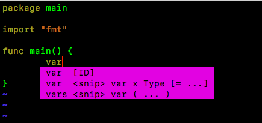

## my_vim

####1. 使用Vundle　最新版本安装和配置
####2. 目前的配置缺少主题/背景颜色
####3. vim 插件网站  http://vimawesome.com 
####4. 插件介绍youcompleteme 是一个快速，支持模糊匹配的vim代码不全引擎
        molokai 是vim颜色主题
        ctrlp https://github.com/kien/ctrlp.vim 
#####5. 语言补全
   
   YouCompleteMe [https://github.com/Valloric/YouCompleteMe]() 
        
       安装的时候有点费事，按照文档一步一步安装即可，

#####6 例子
   
   
   
   